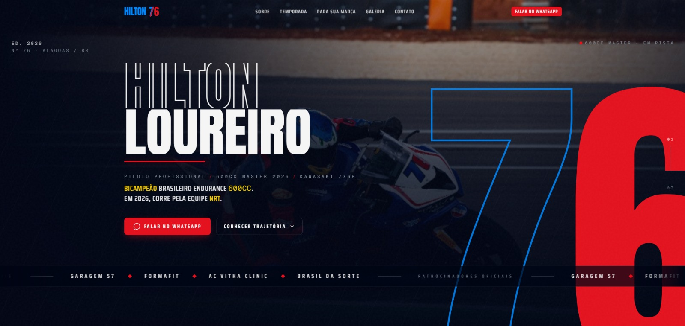

<div align="center">

# Hilton 76 — Landing Site

### Editorial, motion-driven landing for a professional motorcycle racer



*Site copy is in Brazilian Portuguese — the audience is Brazilian. This README is in English for anyone reviewing the codebase.*

</div>

---

## Overview

Single-page editorial site for **Hilton Loureiro #76**, a professional motorcyclist competing in the 2026 Brazilian Moto1000GP Championship.

The brief was a portfolio-grade page that reads like a motorsport editorial spread — heavy display type, scroll-driven cinematography, racing color language — and converts visitors (sponsors, media, fans) into WhatsApp leads. Six sections, ~9k lines of TS/CSS, every interaction designed by hand.

**Status:** development complete · domain registration pending.

---

## What's interesting in this codebase

These are the pieces worth a deeper look — the parts that go past "Next.js + Tailwind landing".

### 🚦 F1 ignition sequence on hero load

Five red lights stagger 0.55s apart, hold for 500ms, then drop simultaneously into a red/yellow radial flash + white overlay — 3.55s total, timed to mimic a real Formula 1 race start. Skipped via `prefers-reduced-motion` with a static signature variant. The radial halo uses a 9-stop exponential gradient under `mix-blend-mode: screen` to avoid visible "knees" in the falloff.

→ [`src/components/sections/hero/ignition-lights.tsx`](src/components/sections/hero/ignition-lights.tsx)

### 🗺️ Custom SVG map of Brazil

All 27 Brazilian states rendered from a Douglas-Peucker-simplified GeoJSON dataset (~430 lines of curated state data, generated by [`scripts/build-states-data.mjs`](scripts/build-states-data.mjs)). Host states are colored by stage status (`next` / `upcoming` / `past`), arcs connect host cities, and clicking any state opens a popover with the rounds racing there.

→ [`src/components/sections/temporada/temporada-map.tsx`](src/components/sections/temporada/temporada-map.tsx)

### 📜 Pinned scrollytelling timeline

The "Sobre" section uses a 300vh sticky container with `useScroll` + `useTransform` to drive: a connecting line that grows 0 → 100%, per-item activation thresholds, year scrub, and a glowing current-item highlight. Pure Framer Motion, no scroll libraries. Falls back to a vertical static list under reduced-motion or `<md` viewports (the 6-column grid was crushing long titles like "Bicampeão Brasileiro Endurance" on mobile).

→ [`src/components/sections/sobre/sobre-timeline.tsx`](src/components/sections/sobre/sobre-timeline.tsx)

### ⚡ Performance — gallery asset optimization

Initial gallery photos shipped at **8.78 MB total** (originals were 4747×3165 at quality 100). I wrote a reusable script using `sharp` + mozjpeg that resizes to a max width of 2000px, applies q80 mozjpeg encoding, strips EXIF, and only replaces files if the result is actually smaller.

Result: **8.78 MB → 1.61 MB (-82%)**, visually indistinguishable. The gallery section also dropped its `priority` flags (it lives below the fold) and a `mix-blend-multiply` overlay that was thrashing the compositor on scroll.

→ [`scripts/optimize-photos.mjs`](scripts/optimize-photos.mjs)

### 🎨 Tailwind v4 design system in pure CSS

Semantic tokens defined via `@theme` directly in [`globals.css`](src/app/globals.css) — no `tailwind.config.js`. All color usage goes through tokens (`bg-racing-blue-deep`, `text-racing-red`, `border-racing-yellow`), so zero hex literals in components. Easy to retheme, easy to audit.

### 🖼️ Dynamic Open Graph image

1200×630 OG image generated server-side at build time via [`next/og`](https://nextjs.org/docs/app/api-reference/functions/image-response) (Satori). The hero photo is read from disk and embedded as base64 (no runtime URL dependency), then the brand stack is typeset over a vignette + red tint gradient. Looks good even when WhatsApp / Discord crop it square (`objectPosition: 65% 45%` keeps the rider visible).

→ [`src/app/opengraph-image.tsx`](src/app/opengraph-image.tsx)

### 🛡️ SSR-safe `useReducedMotion`

Framer Motion's built-in hook was crashing in production-minified builds. Replaced with a small custom hook using `useState` + `useEffect` (originally tried `useSyncExternalStore`, swapped after observing prod issues). Used everywhere a component needs to opt out of motion — including non-Framer components.

→ [`src/lib/use-reduced-motion-safe.ts`](src/lib/use-reduced-motion-safe.ts)

### ✏️ Custom motion primitives

Three reusable components built from scratch and used across the landing:

- **`CharReveal`** — character-by-character mask reveal for editorial headings
- **`MaskReveal`** — directional clip-path reveals (left/right/up/down)
- **`FlipCounter`** — split-flap odometer for stat counters

→ [`src/components/motion/`](src/components/motion/)

---

## Stack

| Category | Tools |
|---|---|
| Framework | Next.js 16 (App Router · Turbopack), React 19, TypeScript |
| Styling | Tailwind CSS v4 (config-in-CSS), shadcn/ui primitives |
| Motion | Framer Motion, Lenis (smooth scroll) |
| Imaging | `next/image`, `sharp` (build-time), `next/og` (OG image) |
| Hosting | Vercel |

---

## Architecture

```
src/
├── app/
│   ├── layout.tsx              # Metadata, fonts, providers
│   ├── page.tsx                # 6-section composition
│   ├── opengraph-image.tsx     # Dynamic OG via next/og
│   └── globals.css             # @theme tokens (Tailwind v4)
├── components/
│   ├── sections/
│   │   ├── hero/               # F1 ignition, name reveal, parallax
│   │   ├── sobre/              # Bio + scroll-locked timeline
│   │   ├── temporada/          # Brazil map + 8 rounds + popovers
│   │   ├── patrocinio/         # Sponsor pitch + activations + LED rail
│   │   ├── galeria/            # Editorial asymmetric photo grid
│   │   └── contato/            # WhatsApp form + press kit download
│   ├── motion/                 # CharReveal, MaskReveal, FlipCounter
│   └── ui/                     # shadcn primitives
└── lib/
    ├── use-reduced-motion-safe.ts
    └── links.ts                # Centralized external links
```

---

## Run locally

```bash
npm install
npm run dev
```

App at [http://localhost:3000](http://localhost:3000).

| Script | Purpose |
|---|---|
| `npm run dev` | Dev server (Turbopack) |
| `npm run build` | Production build |
| `npm run start` | Serve the production build |
| `npm run lint` | ESLint |
| `node scripts/optimize-photos.mjs <dir>` | Recompress JPEGs in `<dir>` (max 2000px, q80 mozjpeg) |

---

## Credits

**Built and designed by [Vinicius Soares Loureiro](https://www.linkedin.com/in/vsloureiro/)** — web engineer focused on motion-rich, content-driven sites.

- LinkedIn — [in/vsloureiro](https://www.linkedin.com/in/vsloureiro/)
- GitHub — [@ViniciusLoureiro67](https://github.com/ViniciusLoureiro67)

**Client:** Hilton Loureiro #76 — professional motorcycle racer, two-time Brazilian Endurance 600cc champion (2024 & 2025). [Instagram](https://www.instagram.com/hilton_loureiro76/).

---

*Personal repository · not published to any package registry.*
